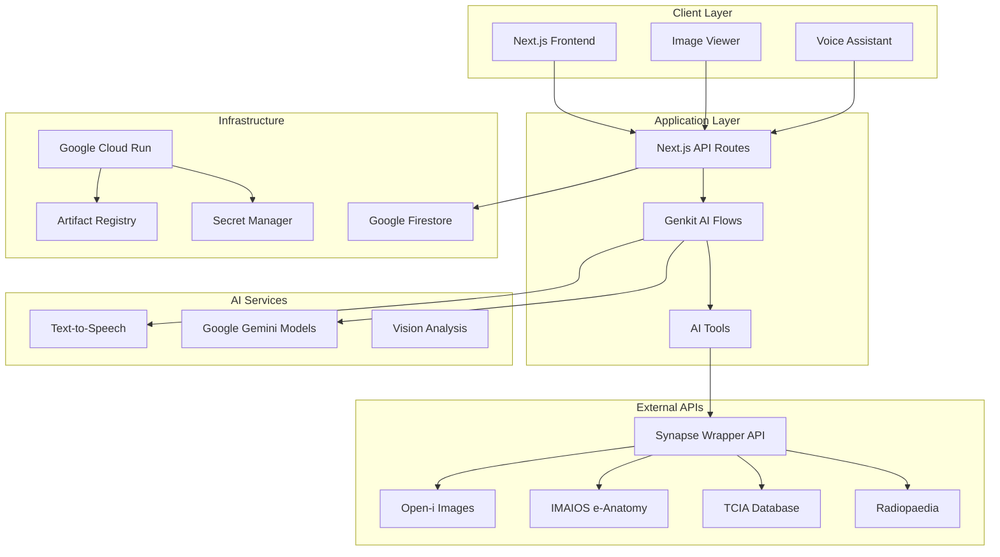
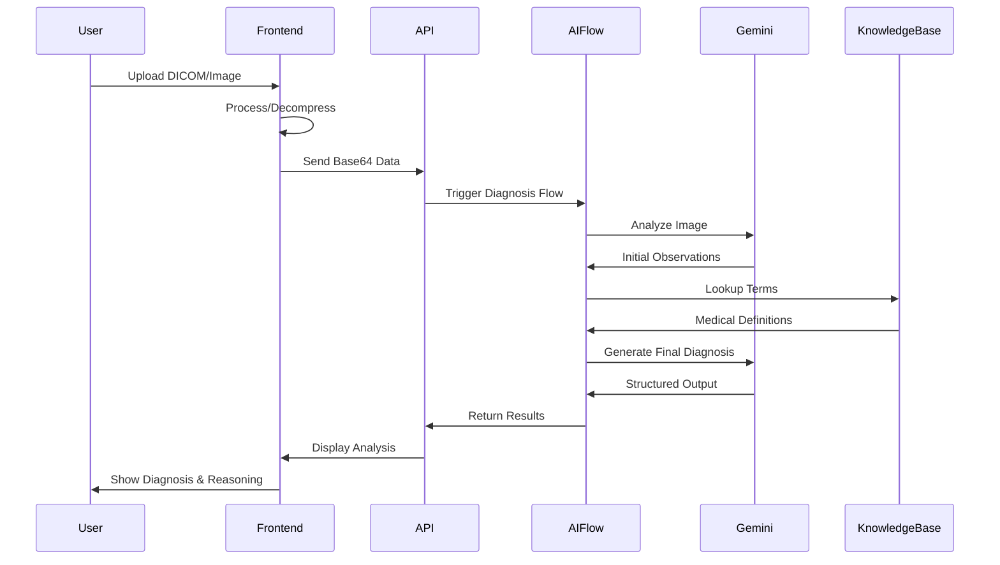
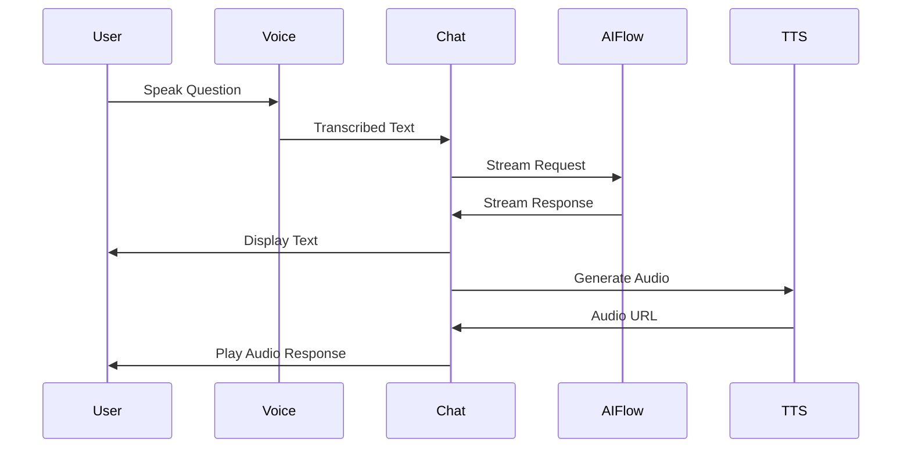

# Synapse AI - System Architecture

## Overview

Synapse AI is a sophisticated medical imaging AI platform built on modern cloud-native architecture. The system combines Next.js frontend capabilities with Google Cloud AI services to deliver real-time diagnostic assistance for radiologists.

## High-Level Architecture



## Component Architecture

### Frontend Layer

#### Next.js Application (App Router)
- **Framework**: Next.js 15+ with App Router architecture
- **Rendering**: Server-side rendering with client-side hydration
- **Routing**: File-based routing system
- **Components**: React 18+ with TypeScript

#### Key Frontend Components

**Professional Image Viewer**
```typescript
// Interactive DICOM viewer with advanced controls
- Canvas-based rendering for medical images
- Windowing controls (brightness/contrast)
- Multi-frame carousel support
- Video playback with frame extraction
- Zoom, pan, and measurement tools
```

**Voice Assistant Interface**
```typescript
// Speech recognition and audio playback
- Web Speech API integration
- Real-time transcription
- Text-to-speech responses
- Hands-free operation
```

**Chat Interface**
```typescript
// Real-time AI conversation
- Streaming text responses
- Message history management
- Media upload support
- Context-aware interactions
```

### Application Layer

#### AI Flow Orchestration (Google Genkit)

**Core Flows**
1. **AI-Assisted Diagnosis Flow**
   - Primary diagnostic analysis
   - Multi-modal input processing
   - External knowledge integration
   - Structured output generation

2. **Chat Flow**
   - Conversational AI interface
   - Context management
   - Tool integration
   - Streaming responses

3. **Report Generation Flow**
   - Structured report creation
   - Template processing
   - Clinical formatting
   - Quality validation

4. **Summarization Flow**
   - Report condensation
   - Key finding extraction
   - Clinical relevance filtering

#### AI Tools System

**Knowledge Base Tools**
```typescript
// External medical database integration
searchClinicalKnowledgeBase()    // Radiopaedia definitions
searchPublicResearchDatasets()   // TCIA imaging collections
searchImaiosAnatomy()           // Anatomical structure lookup
searchMedicalImageDatabase()    // Open-i visual references
searchXNATProjects()           // Internal dataset access
searchDrugInfo()               // Pharmaceutical information
```

**Case Management Tools**
```typescript
// Historical case analysis
findCaseExamplesTool()         // Similar case retrieval
saveFinalReportTool()         // Case archival
```

### AI Services Layer

#### Google Gemini Models

**Model Hierarchy**
1. **Primary Model**: `gemini-1.5-pro-latest`
   - Complex reasoning tasks
   - Multi-modal analysis
   - Tool usage capabilities
   - High accuracy requirements

2. **Fallback Model**: `gemini-1.5-flash-latest`
   - Fast processing
   - Cost optimization
   - Service reliability
   - Basic analysis tasks

3. **Specialized Models**: `gemini-2.0-flash-preview-image-generation`
   - Image annotation
   - Visual enhancement
   - Diagram generation

#### Model Selection Strategy

```typescript
// Intelligent model routing
const modelStrategy = {
  primary: 'gemini-1.5-pro-latest',
  fallback: 'gemini-1.5-flash-latest',
  retryLogic: {
    maxAttempts: 2,
    backoffDelay: 1000,
    fallbackOnError: true
  }
};
```

### External Integration Layer

#### Synapse Wrapper API

**Purpose**: Proprietary unified interface to medical knowledge bases

**Architecture Benefits**:
- **Abstraction**: Unified API for multiple data sources
- **Security**: Centralized authentication and rate limiting
- **Reliability**: Error handling and fallback mechanisms
- **Scalability**: Caching and optimization strategies

**Integrated Services**:
```typescript
// Medical knowledge sources
interface ExternalServices {
  radiopaedia: RadiopaediaAPI;     // Clinical definitions
  tcia: TCIADatabase;              // Cancer imaging archive
  imaios: ImaiosAnatomy;           // Anatomical atlas
  openi: OpenIDatabase;            // Medical image database
  xnat: XNATServer;                // Internal imaging archive
}
```

### Data Layer

#### Google Firestore
- **Purpose**: Case history storage and retrieval
- **Structure**: Document-based NoSQL database
- **Features**: Real-time synchronization, offline support
- **Security**: Rule-based access control

**Data Models**:
```typescript
interface CaseHistory {
  id: string;
  timestamp: Date;
  imageUri: string;
  diagnosis: AiAssistedDiagnosisOutput;
  finalReport: GenerateStructuredReportOutput;
  radiologistNotes: string;
  metadata: {
    studyType: string;
    patientAge?: number;
    findings: string[];
  };
}
```

### Infrastructure Layer

#### Google Cloud Run
- **Deployment**: Containerized serverless platform
- **Scaling**: Automatic horizontal scaling
- **Performance**: Cold start optimization
- **Security**: VPC integration and IAM controls

#### CI/CD Pipeline

```yaml
# Cloud Build Pipeline
steps:
  - name: 'gcr.io/cloud-builders/docker'
    args: ['build', '-t', 'gcr.io/$PROJECT_ID/synapse-ai', '.']
  
  - name: 'gcr.io/cloud-builders/docker'
    args: ['push', 'gcr.io/$PROJECT_ID/synapse-ai']
  
  - name: 'gcr.io/cloud-builders/gcloud'
    args: ['run', 'deploy', 'synapse-ai',
           '--image', 'gcr.io/$PROJECT_ID/synapse-ai',
           '--platform', 'managed',
           '--region', 'us-central1']
```

## Data Flow Architecture

### Image Processing Pipeline



### Chat Interaction Flow



## Security Architecture

### Authentication & Authorization
- **API Keys**: Environment-based credential management
- **Service Accounts**: Google Cloud IAM integration
- **Request Validation**: Schema-based input validation
- **Rate Limiting**: Request throttling and abuse prevention

### Data Protection
- **Encryption**: TLS 1.3 for data in transit
- **Privacy**: No persistent storage of medical images
- **Compliance**: HIPAA-aware design patterns
- **Audit Logging**: Comprehensive request logging

### Network Security
```typescript
// Security headers configuration
const securityHeaders = {
  'Strict-Transport-Security': 'max-age=31536000',
  'X-Content-Type-Options': 'nosniff',
  'X-Frame-Options': 'DENY',
  'X-XSS-Protection': '1; mode=block',
  'Referrer-Policy': 'strict-origin-when-cross-origin'
};
```

## Performance Architecture

### Optimization Strategies

**Frontend Performance**
- **Code Splitting**: Dynamic imports for large components
- **Image Optimization**: Next.js automatic image optimization
- **Caching**: Browser caching for static assets
- **Lazy Loading**: Component-level lazy loading

**Backend Performance**
- **Model Caching**: Intelligent AI model response caching
- **Connection Pooling**: Database connection optimization
- **Compression**: Response compression (gzip/brotli)
- **CDN Integration**: Global content delivery

**AI Processing Optimization**
```typescript
// Performance monitoring
const performanceMetrics = {
  imageProcessingTime: number;
  aiInferenceTime: number;
  knowledgeBaseLookupTime: number;
  totalResponseTime: number;
  modelTokenUsage: number;
};
```

## Scalability Architecture

### Horizontal Scaling
- **Stateless Design**: No server-side session storage
- **Load Balancing**: Google Cloud Load Balancer
- **Auto Scaling**: Cloud Run automatic scaling
- **Database Scaling**: Firestore automatic scaling

### Vertical Scaling
- **Resource Allocation**: Dynamic CPU/memory allocation
- **Model Optimization**: Efficient AI model usage
- **Caching Layers**: Multi-level caching strategy
- **Connection Management**: Optimized database connections

## Monitoring & Observability

### Application Monitoring
```typescript
// Genkit observability
const monitoring = {
  flowExecution: 'Real-time flow monitoring',
  errorTracking: 'Comprehensive error logging',
  performanceMetrics: 'Response time tracking',
  usageAnalytics: 'API usage statistics'
};
```

### Infrastructure Monitoring
- **Cloud Monitoring**: Google Cloud monitoring integration
- **Alerting**: Automated alert system
- **Logging**: Centralized log aggregation
- **Tracing**: Distributed request tracing

## Deployment Architecture

### Environment Strategy
```typescript
// Multi-environment configuration
const environments = {
  development: {
    aiModels: 'gemini-1.5-flash-latest',
    database: 'firestore-dev',
    monitoring: 'basic'
  },
  staging: {
    aiModels: 'gemini-1.5-pro-latest',
    database: 'firestore-staging',
    monitoring: 'full'
  },
  production: {
    aiModels: 'gemini-1.5-pro-latest',
    database: 'firestore-prod',
    monitoring: 'enterprise'
  }
};
```

### Disaster Recovery
- **Multi-Region Deployment**: Geographic redundancy
- **Backup Strategy**: Automated database backups
- **Failover Mechanisms**: Automatic service failover
- **Recovery Procedures**: Documented recovery processes

## Future Architecture Considerations

### Planned Enhancements
1. **Edge Computing**: Edge AI processing for reduced latency
2. **Federated Learning**: Distributed model training
3. **Advanced Caching**: Intelligent prediction caching
4. **Multi-Cloud**: Hybrid cloud deployment strategy

### Scalability Roadmap
1. **Microservices**: Service decomposition for better scaling
2. **Event-Driven Architecture**: Asynchronous processing
3. **API Gateway**: Centralized API management
4. **Service Mesh**: Advanced service communication

---

This architecture documentation provides a comprehensive overview of Synapse AI's system design, focusing on scalability, security, and maintainability for medical AI applications.